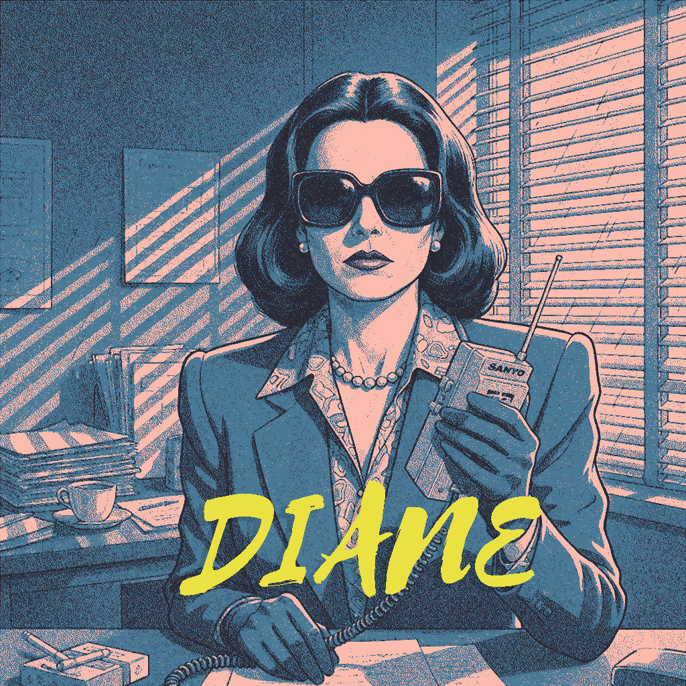

# Diane

**Your AI vault analyst and creative consultant for Obsidian**

Diane is a Claude Code plugin that transforms voice-captured notes into structured Zettelkasten notes with automatic linking and intelligent organization. Built for the Obsidian + Claude Code workflow, Diane reduces friction in your knowledge capture pipeline.

## Features

- **Voice Note Processing** (`/playback`) - Transform SuperWhisper transcriptions into atomic, well-linked permanent notes
- **Semantic Link Discovery** (`/find-links`) - Find conceptual connections across your entire vault
- **Vault Analysis** (`/consult`) - Get insights and discover patterns in your knowledge graph
- **Intelligent Context Detection** - Resolves vague references by analyzing recent notes
- **Interactive Workflow** - One-by-one review with full editorial control

## Philosophy

Based on Sönke Ahrens' *How to Take Smart Notes*:

- **Reduce capture friction** - Voice → structured note in minimal steps
- **Build knowledge graph** - Every note connects to existing ideas
- **Atomic notes** - One idea, one note, many connections
- **Semantic over keyword** - Find conceptual relationships, not just text matches
- **Progressive elaboration** - Fleeting → Literature → Permanent → Project → Output

## Installation

### Prerequisites

1. [Claude Code](https://claude.com/code) installed
2. [Obsidian](https://obsidian.md/) with your vault configured
3. [Templater plugin](https://github.com/SilentVoid13/Templater) for Obsidian

### Quick Start

```bash
# Add the marketplace
/plugin marketplace add https://github.com/yourusername/diane

# Install the plugin
/plugin install diane@diane

# Restart Claude Code
```

For detailed installation instructions, see [diane/README.md](./diane/README.md).

## Commands

### `/playback` - Process Voice Notes

Process voice-transcribed notes from your Diane folder into structured Zettelkasten notes.

```bash
/playback
```

**What it does:**
1. Lists unprocessed voice notes with preview
2. Expands conversational transcriptions into clear prose
3. Finds semantic connections to existing notes
4. Suggests wikilinks and destination folders
5. Creates properly formatted atomic notes

### `/find-links` - Discover Connections

Find semantically related notes and suggest wikilinks.

```bash
/find-links
```

**What it does:**
1. Analyzes note concepts and themes
2. Searches vault for related notes (semantic, not keyword matching)
3. Ranks connections by confidence level
4. Provides ready-to-paste wikilinks
5. Identifies conceptual clusters and gaps

### `/consult` - Vault Analysis

Consult with Diane to analyze patterns and discover creative connections.

```bash
/consult
```

**What it does:**
1. Reads your Zettelkasten notes
2. Identifies patterns and themes
3. Suggests unexpected connections
4. Provides fresh perspective on your thinking

## Vault Structure

```
Slip Box/
├── 00 Diane/              # Voice note captures
│   └── processed/         # Archived notes
├── 10 Fleeting notes/     # Quick captures
├── 20 Literature notes/   # Source insights
├── 30 Permanent notes/    # Atomic ideas
├── 40 Project notes/      # Active work
├── 99 Output/             # Published work
└── _templates/            # Templater templates
```

## Daily Workflow

1. **Capture** - Use SuperWhisper throughout the day → Notes saved to `00 Diane/`
2. **Process** - Evening review with `/playback`
3. **Connect** - Weekly review with `/find-links` on recent notes
4. **Consult** - Ask `/consult` for insights when exploring themes
5. **Create** - Build projects from connected permanent notes

## Configuration

Edit `diane/.claude-plugin/plugin.json` to customize:
- Vault path
- Folder names
- Naming conventions
- Template locations

## Note Format

All notes use atomic Zettelkasten structure with frontmatter, main idea, significance, evidence, and wikilinks. See [templates](./diane/templates/) for examples.

## Contributing

This is a personal workflow plugin built for my specific Obsidian setup, but suggestions and improvements are welcome! Open an issue or submit a PR.

## License

MIT

## Acknowledgments

- Inspired by Sönke Ahrens' *How to Take Smart Notes*
- Built for Obsidian + Claude Code workflow
- Icon design inspired by Twin Peaks

---

**Version:** 1.0.0
**Author:** Marcus Estes
**Documentation:** [Full documentation](./diane/README.md)
